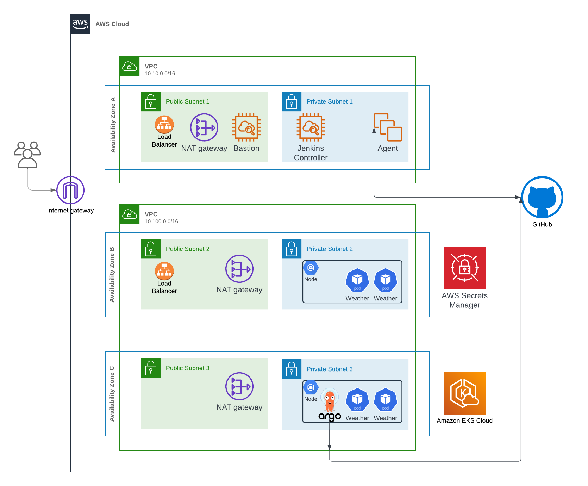

---

# Leumi Home Assignment

## Table of Contents

- [Exercise 1: Jenkins Declarative Pipeline Process](#exercise-1-jenkins-declarative-pipeline-process)
    - [Prerequisites](#prerequisites)
    - [What Was Done](#what-was-done)
    - [ArgoCD Usage](#argocd-usage)
    - [Challenges Faced](#challenges-faced)
- [Infrastructure Explanation (for Exercise 1)](#infrastructure-explanation-for-exercise-1)
- [Exercise 5: Terraform for EC2 Setup](#exercise-5-terraform-for-ec2-setup)
- [Terraform-Docs Command](#terraform-docs-command)
- [TroubleShooting Exercises(2-3-4)](#troubleshooting-exercises) 
---

## Exercise 1: Jenkins Declarative Pipeline

---



## Approach to Part 1: Home Assignment

At the beginning of the project, I focused on carefully scoping the infrastructure requirements to ensure I could meet the assignment’s objectives effectively. After analyzing the needs, I concluded that the infrastructure should be divided into two distinct VPCs to ensure network isolation:

- **VPC 1**: For CI environment resources, which include non-cluster components like Jenkins.
- **VPC 2**: For the Kubernetes (EKS) cluster, where the Python application would be deployed.

From there, I mapped out the key components and the Terraform modules I would need to create:

1. **VPC Modules**: Separate VPCs for the EKS cluster and the CI environment.
2. **Instance Modules**: Jenkins Master and Jenkins Agent, each deployed on its own EC2 instance.
3. **Security Group Modules**: Tailored security groups for each instance to manage ingress and egress rules.
4. **EKS Module**: A fully managed Kubernetes cluster for the application’s deployment.
5. **Add-On Modules**: EKS cluster add-ons, such as CoreDNS, kube-proxy, and vpc-cni, to enhance the cluster’s functionality.
6. **IAM Roles Modules**: Multiple IAM roles for the cluster, including roles for the control plane and worker nodes.

With this approach, I ensured modularity and scalability, allowing for flexibility in future adjustments to the infrastructure.

### Terraform Execution

To execute the Terraform configuration, follow the plan and apply process:

```bash
terraform plan -out plan
terraform apply plan
```

This workflow ensures that changes are reviewed before being applied, providing an opportunity to validate the proposed infrastructure modifications.

---

### Prerequisites

- A Jenkins environment set up with Docker and Kubernetes.
- An accessible GitHub repository to store the project files.
- Access to Docker Hub for pushing and storing Docker images.
- A Kubernetes cluster to deploy the application as a Pod.

### Pipeline

The assignment required creating a Jenkins process based on a declarative Jenkins pipeline, which:

1. Builds an application (written in Python or any other language) on one server.
2. Wraps it in a Docker container and runs it on a second server as a Kubernetes Pod.
3. The application is exposed externally on port 443.
4. The solution is uploaded to GitHub.

A full CI/CD pipeline was implemented using Jenkins and Docker. The pipeline automates the process of building a Docker image for the Python application, pushing it to Docker Hub, and then updating the Kubernetes deployment by modifying the `values.yaml` file in the corresponding GitHub repository.


Additionally, a certificate was added for HTTPS, created using the following OpenSSL command:

```bash
openssl req -x509 -nodes -days 365 -newkey rsa:2048 -keyout tls.key -out tls.crt -subj "/CN=app.example.com/O=example"
```

The TLS certificate for the application is managed through AWS Secrets Manager. A Helm chart is deployed to integrate EKS with AWS Secrets Manager, allowing the certificate to be securely accessed and used by the application. This setup ensures seamless and secure management of the TLS certificate, eliminating the need for manual secret creation.

The application is deployed via the [`app.yaml`](application/app.yaml) file.

### ArgoCD Usage

- [GitHub Repository for ArgoCD](https://github.com/Shossi/Leumi-Kubernetes). \
ArgoCD was used to handle continuous deployment for the Kubernetes resources. The `values.yaml` file is updated in a separate GitHub repository that ArgoCD syncs with, ensuring automatic deployment of the Python application when changes are pushed.

---

## Challenges Faced

During the project, one of the initial challenges was creating an instance role for the Jenkins agent to access the Kubernetes cluster. This involved attaching a role to the instance and applying specific changes to provide the required permissions for Kubernetes API access. This approach felt cumbersome and difficult to implement effectively.

Implementing ArgoCD solved this problem by automating the deployment and management of Kubernetes resources. ArgoCD allowed us to remove the direct dependency on the Jenkins agent for accessing and managing the Kubernetes cluster, simplifying the workflow and improving security.

---

## Infrastructure Explanation (for Exercise 1)

The infrastructure is designed for flexibility, security, and scalability, broken into the following key components:

1. **Two VPCs**:
    - **VPC 1** (CI environment): Dedicated for non-cluster resources such as Jenkins Master, Jenkins Agent, and the bastion host. Contains both public and private subnets.
    - **VPC 2** (Kubernetes Cluster): Dedicated for the EKS cluster, ensuring logical isolation from non-cluster resources. Contains subnets for public and private access to the cluster.

2. **EC2 Instances**:
    - **Jenkins Master**: Deployed in a private subnet, secured by a LoadBalancer to allow external traffic on port 8080 (via the NLB).
    - **Jenkins Agent**: Runs in a private subnet, only accessible by Jenkins Master for build jobs.
    - **Bastion Host**: Used for secure SSH access to the Jenkins Master and other internal instances.

3. **Security Groups**:
    - Dedicated security groups for each component (Jenkins Master, Agent, EKS Nodes) ensure granular control over ingress and egress traffic.
    - The bastion host security group allows SSH access to internal components.

4. **EKS Cluster**:
    - A fully managed Kubernetes cluster with both public and private endpoints. It leverages the NodeGroup module for automatic scaling of worker nodes based on the demand.
    - Addons such as **CoreDNS**, **kube-proxy**, and **vpc-cni** enhance cluster networking and service discovery.

5. **Helm**:
    - Helm is used to manage and deploy the Python application within the EKS cluster, ensuring a streamlined, templated approach to Kubernetes resource management.

6. **LoadBalancer**:
    - A Network Load Balancer (NLB) exposes Jenkins Master externally, allowing access over port 8080.

7. **IAM Roles**:
    - Roles are created for the EKS cluster, nodes, and Jenkins components, ensuring least privilege access is maintained throughout the infrastructure.

More information can be found in the corresponding Terraform module readme files:
- [Exercise 1 Readme](terraform/exercise_1/readme.md)

---

## Exercise 5: Terraform for EC2 Setup

For Exercise 5, the goal was to write a Terraform file to create a Linux-based EC2 machine identical to the TEST EC2. The machine was required to:

1. Run Apache on port 80 using the HTTP protocol.
2. Have a fixed public IP address (VIP).
3. Include a security group that allows access only from Leumi Proxy's IP address (91.231.246.50).

More information can be found in the corresponding Terraform module readme files:
- [Exercise 5 Readme](terraform/exercise_5/readme.md)

---

## Terraform Modules

```
├───Modules
│   ├───EC2
│   ├───EKS
│   │   ├───Addon
│   │   ├───Cluster
│   │   ├───Helm
│   │   └───NodeGroup
│   ├───LoadBalancer
│   ├───Module_Template
│   ├───Roles
│   ├───SecurityGroup
│   └───VPC
```

---

## Terraform-Docs Command

Terraform documentation is generated via terraform-docs.
```bash
terraform-docs markdown . > README.md
```

This command will output the Terraform module documentation into the README file, keeping your infrastructure documentation up-to-date.

---

## TroubleShooting Exercises

### Exercise 2a
**- TEST EC2 machine cant get resolve dns of external services -**
* I would check the DNS resolver by looking at `/etc/resolv.conf` to see if there is any misconfiguration and verify if it uses the default AWS DNS resolver (`169.254.169.253`).
* After that, I would check the security groups, ACLs, and firewall rules, ensuring that port 53 isn't blocked. - in case we're not using aws default / internal dns server.
* If both are configured correctly and the DNS server isn't the AWS default, I would then check the routing rules to ensure they are correctly routing to the NAT Gateway.

---

### Exercise 2b
**- Test EC2 doesn't have network connectivity -**
* I would check the ENI for both the instance and NAT Gateway to ensure they are properly configured and attached.
* Then, I would check the routing rules to verify that traffic is correctly routed to the NAT Gateway.
* I would also review the security group rules to confirm that HTTP/HTTPS or the required ports are allowed for outbound traffic.
* After that, I would check the Network ACLs at the subnet level to make sure they allow the necessary ports (HTTP/HTTPS or others).
* Lastly, I would inspect the firewall rules (Checkpoint or NFW) to ensure they are not blocking the traffic.

---

### Exercise 2c

* **i.** - Pull access denied – permissions problem. The EC2 test instance can communicate with the Docker repo but lacks the necessary permissions. Check if the repo is private, and confirm if it should be private or public and ensure proper authentication.
* **ii.a** - Container pull timeout – network/configuration problem. Check the routing rules, security groups, NACLs, and potentially the firewall (if it plays a role in internal traffic). Since both are connected via the TGW, the communication should be internal, governed by these configurations.
* **ii.b** - Nexus timeout – Check if the timeout setting on the Nexus server is set too low, which could be causing the timeout issue during pulls.
* **iii.** - Docker daemon is not running – Likely an internal Docker issue. Check the Docker service on the instance using systemctl status docker, verify the installation, and check system resources to ensure the Docker daemon can run properly.

---

### Exercise 3

* First, validity of DNS resolution is checked using nslookup or ping. I would check routing rules, security groups, NACLs, and firewall rules that could interfere with the connection.

* Looking at the diagram, I see that the Test EC2 machine is in a private subnet, and there's no specific component to handle the routing or load balancing. If a component like a Load Balancer were present, I would check its configuration to ensure it routes traffic correctly to the EC2 instance.

* After verifying that all network components are properly configured, I would check machine-specific configurations. This includes ensuring the SSL certificate is valid and the machine can handle SSL termination. Finally, I would check the service itself, ensuring it's correctly configured to listen on port 443.

---

### Exercise 4

Installation of telnet on an Amazon Linux machine would be done via the following command:

```bash
sudo yum install -y telnet
```

There are many issues that may occur:

* There could be a disk space issue, meaning there’s not enough space to install the package. This can be checked using `df -h` to see available space.

* It could be a permissions issue. System policies may prevent installing tools or restrict the use of yum. Check for security policies like SELinux or AppArmor that might be enforcing these restrictions.

* The YUM package database may be outdated fixed by : `sudo yum update -y`

* The telnet repository might be disabled. You can check this via: \
`yum repolist all` \
If it's disabled, enable it using: \
`sudo yum-config-manager --enable <repo-id>`

* The YUM repository metadata may be stale and needs to be refreshed by running: \
`sudo yum clean all && sudo yum makecache`\
  This deletes and updates the YUM cache.

* There could also be a network issue—the route from the Test EC2 machine to the NAT Gateway might not be properly configured, preventing the machine from accessing the internet.

---


